# Keel Modernization: Adoptable Managed Delivery for OSS Spinnaker

Status: **Draft, iterating.** Started 2026-09-26.
Owner: Jason McIntosh
Scope: `keel/`, plus integration points in `echo/`, `igor/`, `gate/`, `orca/orca-keel`, `front50/`, `deck/packages/core/src/managed`
Related plans:
- [titus-removal.md](titus-removal.md): project-wide Titus removal. A **separate PR** and a prerequisite for this work.
- [scoped-execution-credentials.md](scoped-execution-credentials.md): distributed bake (WS3 must stay compatible)

---

## Contents

- [Goals, non-goals, decisions](#goals)
- **Part I: How keel works today**
  - [I.1 Concepts](#i1-concepts)
  - [I.2 A delivery config](#i2-a-delivery-config)
  - [I.3 System context](#i3-system-context-today)
  - [I.4 Getting a config into keel](#i4-getting-a-config-into-keel-today)
  - [I.5 Artifact ingestion](#i5-artifact-ingestion-today)
  - [I.6 Promotion: artifact versions through environments](#i6-promotion-artifact-versions-through-environments)
  - [I.7 Reconciliation: the resource check loop](#i7-reconciliation-the-resource-check-loop)
  - [I.8 Deploy completion, verification, post-deploy](#i8-deploy-completion-verification-post-deploy)
  - [I.9 Schedulers and tuning](#i9-schedulers-and-tuning)
  - [I.10 Identities used today](#i10-identities-used-today)
  - [I.11 Module map](#i11-module-map)
- **Part II: How keel should work**
  - [II.1 Target system context](#ii1-target-system-context)
  - [II.2 Onboarding experience](#ii2-onboarding-experience)
  - [II.3 Config sources and trusted integrations](#ii3-config-sources-and-trusted-integrations)
  - [II.4 Identity model](#ii4-identity-model)
  - [II.5 Code events via echo](#ii5-code-events-via-echo)
  - [II.6 Naming via pluggable namers](#ii6-naming-via-pluggable-namers)
  - [II.7 Verification and notifications through platform primitives](#ii7-verification-and-notifications-through-platform-primitives)
- **Part III: Workstreams** (WS0–WS7)
- [Sequencing](#sequencing)
- [Open questions](#open-questions)

---

## Goals

1. **Easy to adopt.** A user can take an existing app deployed by pipelines and put it under keel's management from the UI, without hand-writing YAML or reading Netflix-era docs.
2. **Good UI experience.** Onboarding, a dry-run preview of changes, and clear status for every resource kind keel manages.
3. **Correct platform integration.** Auth goes through Fiat with delegated service accounts (the same model as pipeline permissions). SCM events come via echo, baking via rosco, and naming via the same moniker strategies clouddriver uses.
4. **Provider expansion.** ECS, then Kubernetes, built on the cleaned-up foundation.

## Non-goals (for now)

- **Jackson 3 migration.** Spring Boot 4 still accepts Jackson 2 (`spring.http.converters.preferred-json-mapper: jackson2` in `keel.yml`). Revisit when the next Boot bump forces it.
- **Postgres support.** Keel is MySQL-only: jOOQ codegen against MySQL 5.7, `FOR UPDATE` / `ON DUPLICATE KEY`, 128 Liquibase changesets. Track separately.

## Decisions recorded

| # | Decision | Date |
|---|----------|------|
| D1 | GitHub, Stash/Bitbucket Server and Bitbucket Cloud code events must work via **echo** webhook events. Add GitLab too if cheap, since echo and igor already support it. | 2026-09-26 |
| D2 | **Remove Titus entirely** (OSS Titus is archived). | 2026-09-26 |
| D3 | Keep git auto-import and preview environments, but only after confirming how they interact with events and integrations (done: [I.4](#i4-getting-a-config-into-keel-today), [WS2](#ws2--scm-code-events-via-echo)). | 2026-09-26 |
| D4 | Baking goes through **rosco** (Orca `bake` stage plus rosco's own base-image config), not a keel-side bakery abstraction. | 2026-09-26 |
| D5 | Background calls use a **configured system identity**. Actuation uses a **delegated, managed service account** modeled on pipeline managed service accounts. The auth fix is its own track (WS1). | 2026-09-26 |
| D6 | Replace hard Frigga coupling with a **pluggable naming strategy** that mirrors clouddriver's moniker/namer model (tags/annotations). Frigga stays the default. | 2026-09-26 |
| D7 | Jackson 2 stays for now. | 2026-09-26 |
| D8 | Titus removal is **one separate PR across the whole monorepo** (clouddriver, orca, deck, keel, kork, gate), tracked in [titus-removal.md](titus-removal.md). It is not part of the keel PRs. | 2026-09-26 |

---

# Part I: How keel works today

This section documents behavior **as implemented** (2026-09-26, `main` @ `17fc95c3c6`), including paths that don't function in OSS. Where the behavior is surprising, the code location is cited.

## I.1 Concepts

| Term | Meaning | Code |
|------|---------|------|
| **Delivery config** | One per application. The top-level document: `application`, `serviceAccount`, `artifacts`, `environments`, `previewEnvironments`. Keel's database is the source of truth, whatever path the config arrived by. | `keel-api/.../DeliveryConfig.kt`, `keel-core/.../core/api/SubmittedDeliveryConfig.kt` |
| **Environment** | A named group of resources (e.g. `test`, `staging`, `prod`), plus the **constraints** that gate which artifact versions may enter it, plus verifications, post-deploy actions and notifications. | `keel-api/.../Environment.kt` |
| **Resource** | A desired-state spec for a cloud object, identified by `kind` (`{group}/{kind}@{version}`, e.g. `ec2/cluster@v1.1`) and an ID derived from the spec. Modeled on Kubernetes CRDs. | `keel-api/.../Resource.kt`, `ResourceKind.kt` |
| **Artifact** | A versioned deployable (`docker`, `deb`, `npm`) with a **sorting strategy** that orders versions. Resources that deploy software reference an artifact, not a version. | `keel-api/.../artifacts/*`, `keel-artifact/*` |
| **Resource handler** | Plugin per resource kind. Reports *current* state, resolves *desired* state, and actuates the difference via Orca tasks. | `keel-api/.../plugins/ResourceHandler.kt` |
| **Constraint** | Gate on promoting a version into an environment. Stateless: `depends-on`, `allowed-times`, `image-exists`. Stateful: `manual-judgement`, `pipeline`. | `keel-core/.../constraints/*`, `keel-core/.../core/api/*Constraint.kt` |
| **Verification** | Runs after a version is deployed to an environment. It must pass before the version counts as good there. OSS today has **only** the Titus test-container evaluator. | `keel-api/.../plugins/VerificationEvaluator.kt` |
| **Post-deploy action** | Runs after deploy + verification. Today **only** Titus/EC2 AMI tagging and JAR promotion. | `keel-api/.../plugins/PostDeployActionHandler.kt` |
| **Pin** | Force an environment to a specific version (bypasses constraints). | `EnvironmentPromotionChecker` |
| **Veto / mark-as-bad** | Block a version from an environment. Keel also auto-vetoes versions whose deploys keep failing. | `veto/*`, `ResourceActuator.handleArtifactVetoing` |
| **Pause** | Stop actuation for a resource or a whole application. | `pause/ActuationPauser` |
| **Unhappy veto** | After repeated actuations that don't converge, keel stops acting on a resource until something changes. | `veto/unhappy/UnhappyVeto.kt`, `keel.unhappy.*` |
| **Preview environment** | Temporary copy of a base environment per PR branch, torn down when the PR closes. | `keel-scm/.../preview/*` |
| **Export** | Generate a resource spec from a running cloud resource, or a whole delivery config from existing pipelines. | `keel-web/.../rest/ExportController.kt`, `export/ExportService.kt` |

## I.2 A delivery config

Trimmed from `keel-web/src/test/resources/examples/delivery-config-example.yml`:

```yaml
application: fnord
serviceAccount: delivery-engineering@netflix.com   # identity used for ALL actuation (see I.10)
artifacts:
- name: fnord
  type: deb
  reference: fnord
  vmOptions: { baseOs: bionic, regions: [us-east-1, us-west-2] }   # triggers bakes via Orca/rosco
environments:
- name: test
  constraints: []                       # no gates: latest version flows straight in
  notifications:
  - { type: slack, address: "#fnord-notifications", frequency: quiet }
  resources:
  - kind: ec2/cluster@v1
    spec:
      imageProvider: { reference: fnord } # binds the cluster to the artifact, not a version
      moniker: { app: fnord, stack: test } # → cluster name "fnord-test" (Frigga convention)
      deployWith: { strategy: highlander }
      launchConfiguration: { instanceType: m5.large, iamRole: fnordInstanceProfile, keyPair: fnord-keypair }
      capacity: { min: 0, max: 1, desired: 0 }
      dependencies: { loadBalancerNames: [fnord-test-vpc0], securityGroupNames: [fnord] }
  - kind: ec2/security-group@v1
    spec:
      moniker: { app: fnord }
      description: Application Security Group for fnord
      inboundRules:
      - { protocol: tcp, name: fnord-elb, portRange: { startPort: 7001, endPort: 7002 } }
- name: prod
  constraints:
  - { type: depends-on, environment: test }
  - { type: manual-judgement }
  resources: [ ... ]
```

## I.3 System context (today)

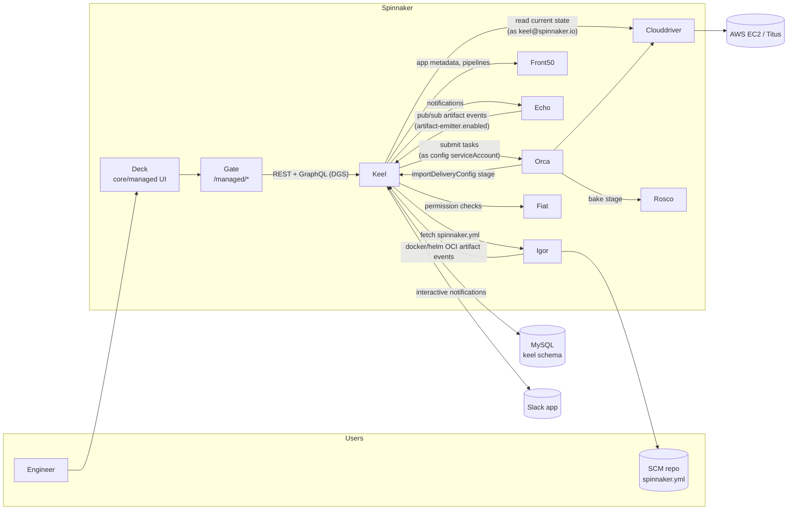

## I.4 Getting a config into keel (today)

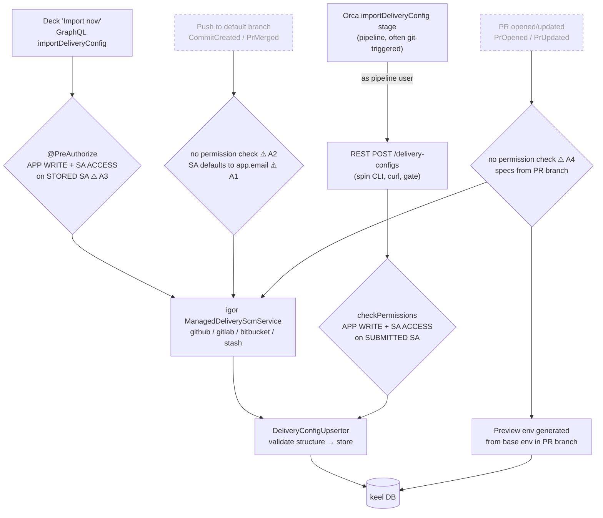

Dashed paths **never fire in OSS**. Keel only recognizes code events posed as fake artifacts from Netflix's internal CI ("Rocket") on `POST /artifacts/events` (`KNOWN_ROCKET_CODE_EVENTS` in `keel-core/.../scm/codeEvents.kt`), and no OSS service produces them. Echo *does* receive and normalize GitHub/Bitbucket/Stash/GitLab webhooks, but only for pipeline git triggers. It never forwards them to keel.

| Path | Works in OSS? | Identity for later actuation |
|------|---------------|------------------------------|
| REST upsert | Yes | `serviceAccount` in the submitted config (caller must have ACCESS) |
| Orca `importDeliveryConfig` stage | Yes, and it's today's OSS answer to "auto-import" | same as REST (pipeline user must have ACCESS) |
| Deck "Import now" | Yes | `serviceAccount` in the *file*, but ACCESS is checked on the *old* one |
| Auto-import on push | No | file's `serviceAccount`, else **app owner's email** |
| Preview environments | No | main config's `serviceAccount`, deploying **PR-branch specs** |

## I.5 Artifact ingestion (today)

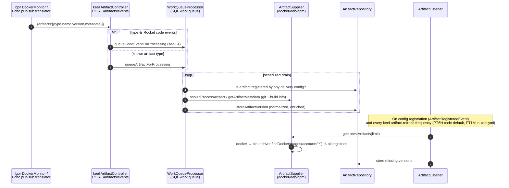

## I.6 Promotion: artifact versions through environments

Each (artifact version, environment) pair has a **promotion status** (`keel-core/.../core/api/PromotionStatus.kt`):

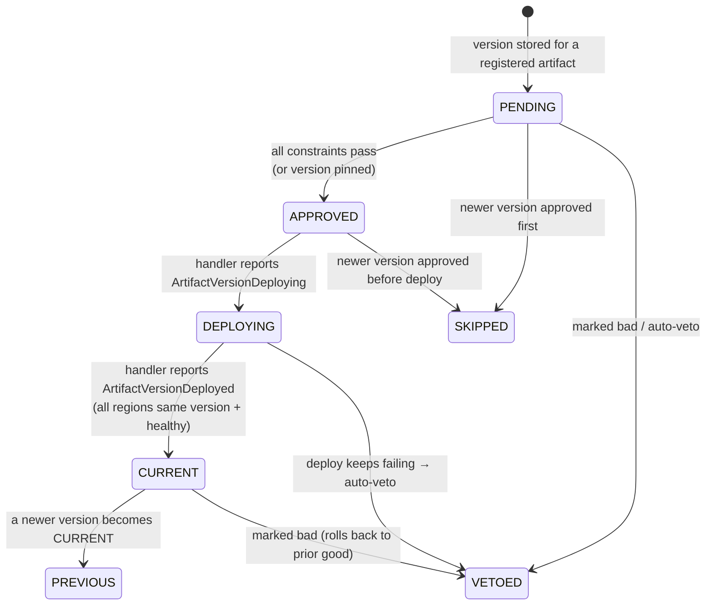

`EnvironmentPromotionChecker.checkEnvironments` runs per delivery config, on the `checkEnvironments` loop:

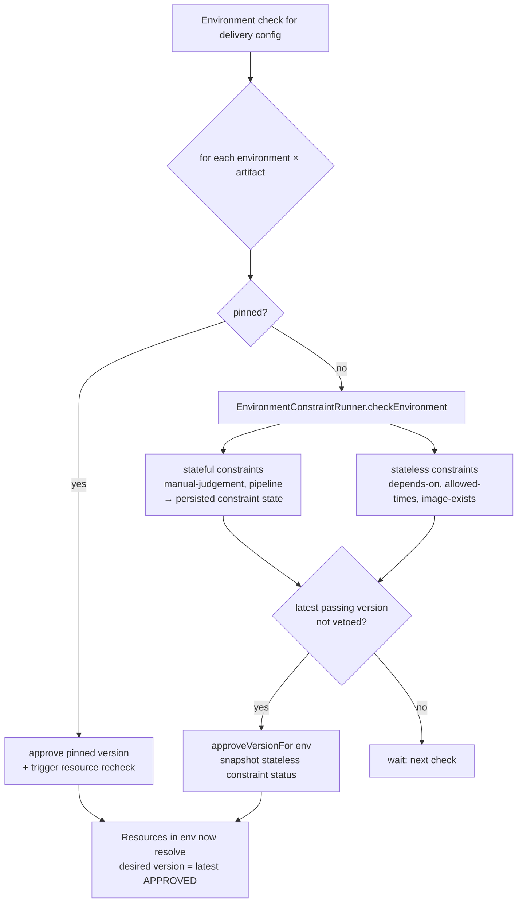

Resource handlers don't pick versions themselves. `desired()` asks the repository for the latest approved version of the referenced artifact in the resource's environment, so **promotion changes desired state, and the reconcile loop does the deploy**.

## I.7 Reconciliation: the resource check loop

`CheckScheduler.checkResources` (every `keel.resource-check.frequency`, default 1s) leases a batch of resources whose last check is older than `minAgeDuration`, then calls `ResourceActuator.checkResource` for each:

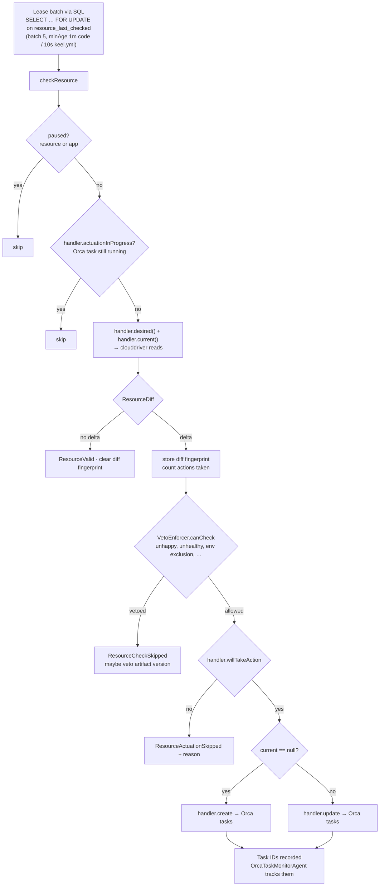

Things operators need to know:
- **Keel will revert out-of-band changes** to a managed resource. To change things by hand, pause first.
- **Removing a resource from the config does not delete it from the cloud.** `CombinedRepository`:162 only deletes keel's row. Cloud deletion happens only when a whole environment is deleted (`EnvironmentCleaner` → `handler.delete`), e.g. preview-environment teardown.
- **Checks in a batch run one after another.** `withTimeout { launch { … } }` waits for its child coroutine, so throughput per replica is roughly `batchSize / (Σ check time + 1s)`.
- Handlers can be smart about deltas: capacity-only diffs resize instead of redeploying, and single-region diffs redeploy only that region (`BaseClusterHandler`).

## I.8 Deploy completion, verification, post-deploy

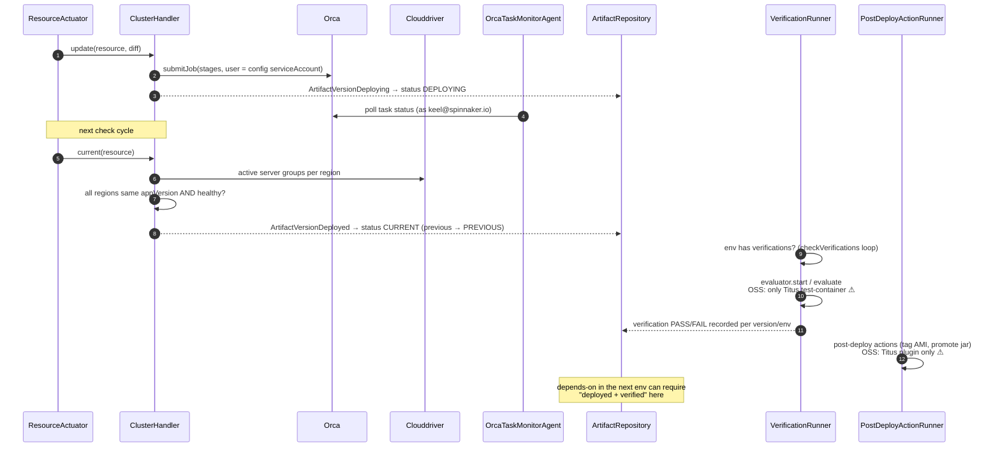

## I.9 Schedulers and tuning

All loops run on every replica. SQL leases keep them from doing the same work twice.

| Loop | Property (frequency) | Default | Batch property | Default batch |
|------|----------------------|---------|----------------|---------------|
| Resource check | `keel.resource-check.frequency` | PT1S | `keel.resource-check.batch-size` | 5 |
| Environment check (promotion) | `keel.environment-check.frequency` | PT1S | `keel.environment-check.batch-size` | 5 |
| Environment deletion | `keel.environment-deletion.check.frequency` | PT1S | – | – |
| Artifact check | `keel.artifact-check.frequency` | PT1S | `keel.artifact-check.batch-size` | 5 |
| Verification | `keel.environment-verification.frequency` | PT1S | `keel.verification.batch-size` | 5 |
| Post-deploy | `keel.environment-post-deploy.frequency` | PT1S | `keel.post-deploy.batch-size` | 5 |
| Scheduled agents (task monitor, etc.) | `keel.scheduled.agent.frequency` | PT1M | – | – |
| Min time between checks of one item | `keel.check.min-age-duration` | 1m (**10s** in shipped `keel.yml`) | – | – |
| Per-item timeout | `keel.*-check.timeout-duration` | 2m | – | – |
| Artifact full refresh | `keel.artifact-refresh.frequency` | PT6H (**PT1M** in `keel.yml`) | – | – |

## I.10 Identities used today

| Call | Identity | Where |
|------|----------|-------|
| Orca task submission (all actuation, bakes) | delivery config `serviceAccount` | `OrcaTaskLauncher.kt:68`, `ImageHandler.launchBake` |
| Clouddriver/front50/orca/echo **reads** | hard-coded `keel@spinnaker.io` (78 call sites) | `DEFAULT_SERVICE_ACCOUNT`, `SubmittedDeliveryConfig.kt:17` |
| Inbound REST/GraphQL | `X-SPINNAKER-USER` from gate, checked by `AuthorizationSupport` | `keel-core/.../auth/AuthorizationSupport.kt` |
| Inbound events (`/artifacts/events`) | none (unauthenticated service-to-service) | `ArtifactController.kt` |
| Git auto-import (would-be) | none at import time. Actuation as file SA or `app.email`. | `DeliveryConfigImportListener.kt` |

## I.11 Module map

| Module | Role |
|--------|------|
| `keel-api` | Plugin SPI: `ResourceHandler`, `ArtifactSupplier`, `ConstraintEvaluator`, `VerificationEvaluator`, `PostDeployActionHandler`, core models |
| `keel-core` | Actuation loops, promotion, constraints, vetoes, auth support, persistence interfaces |
| `keel-sql` | MySQL persistence (jOOQ + Liquibase) |
| `keel-web` | Spring Boot app: REST controllers, DGS GraphQL, export, config wiring |
| `keel-artifact` | Artifact suppliers (docker/deb/npm), work queue, artifact listeners |
| `keel-ec2-api` / `keel-ec2-plugin` | EC2 cluster, security group, CLB/ALB handlers |
| `keel-titus-api` / `keel-titus-plugin` | **Removed by [titus-removal.md](titus-removal.md)** |
| `keel-bakery-plugin` | AMI bake orchestration via Orca `bake` stage, `image-exists` constraint |
| `keel-clouddriver`, `keel-orca`, `keel-front50`, `keel-igor`, `keel-echo` | Retrofit clients + caches for each service |
| `keel-scm` | Git auto-import listener, preview environments |
| `keel-notifications` | Slack app + notification handlers |
| `keel-docker` | Container image resolution helpers |
| `keel-lemur` | Netflix Lemur certificate lookup (optional) |
| `keel-network` | Eureka/DNS endpoint derivation (Netflix-specific) |
| `keel-optics`, `keel-schema-generator` | Lenses for spec manipulation, JSON schema generation for configs |

---

# Part II: How keel should work

## II.1 Target system context

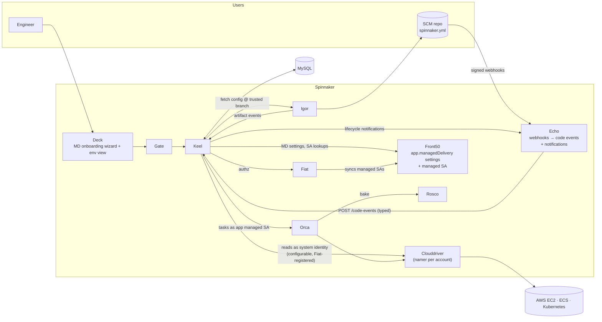

What changes from [I.3](#i3-system-context-today):
- Titus is gone.
- Echo is the single source of code events, and verifies webhook signatures.
- Actuation runs as an app-scoped managed service account.
- Notifications go through echo; the Slack app becomes optional.
- ECS and Kubernetes join EC2.

## II.2 Onboarding experience

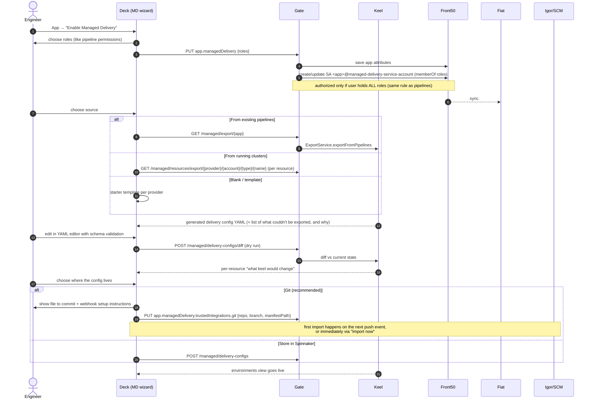

UX principles:
- **Never surprise-deploy.** The first import shows the diff and requires confirmation when it would change running infrastructure. (Pipeline-exported configs usually match reality, so the diff should be empty or small.)
- **Explain every skip.** Paused, vetoed, unhappy, waiting on constraint, actuation in progress: each has a reason and a one-click action, all authorized.
- **Make "unmanaged vs deleted" explicit** when resources leave the config (see [WS5](#ws5--operational-correctness-and-scale)).

## II.3 Config sources and trusted integrations

Application-level settings live in front50 (extending the existing `managedDelivery` app attribute that already holds `importDeliveryConfig` and `manifestPath`):

```yaml
managedDelivery:
  enabled: true
  roles: [team-a-deployers]                                # like pipeline `roles`
  serviceAccount: myapp@managed-delivery-service-account   # generated, read-only
  trustedIntegrations:
    - type: git                                            # auto-import
      repo: github/org/myapp                               # {scmType}/{project}/{slug}
      branch: main                                         # ONLY this branch may change the config
      manifestPath: .spinnaker/spinnaker.yml
    - type: preview                                        # separate, opt-in grant
      repo: github/org/myapp
      branchPattern: "feature/.*"
      allowForks: false
      allowedAccounts: [dev]
```

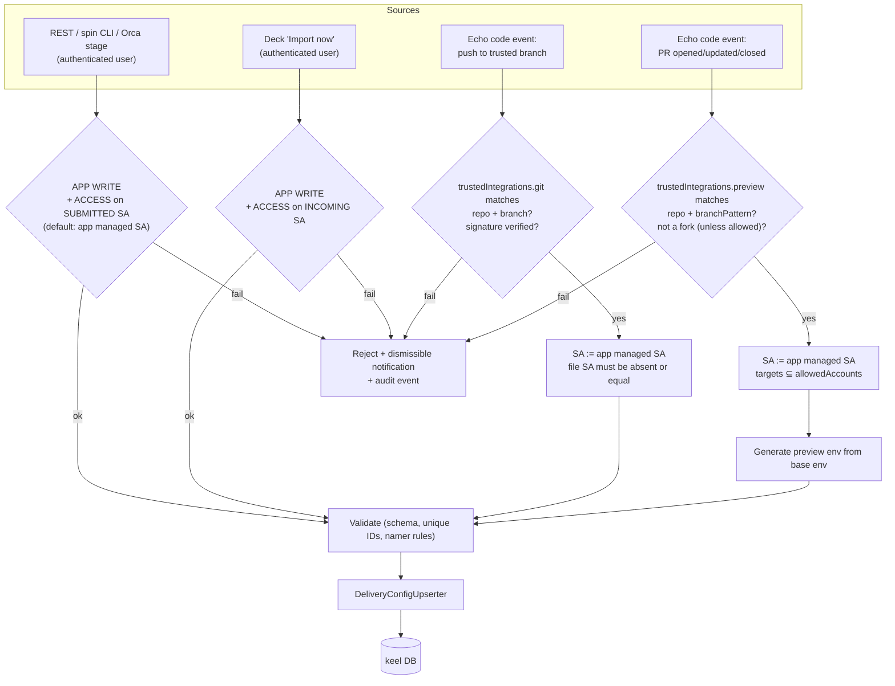

## II.4 Identity model

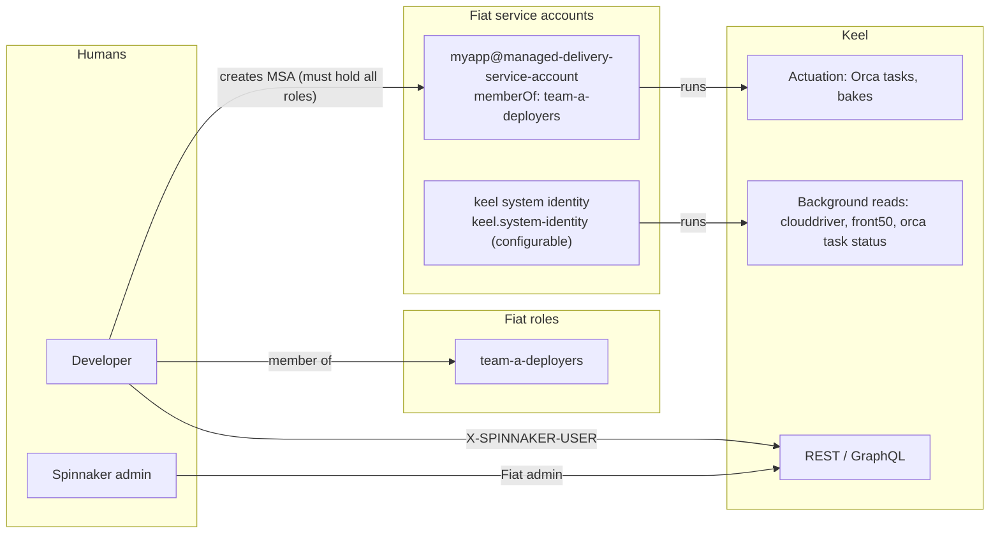

Rules:
1. **Actuation** always runs as the app's managed SA, or as an explicitly named SA the submitting *user* has ACCESS to (REST/CLI only).
2. **Background reads** run as a configured system identity that is registered in Fiat with READ on the apps and accounts keel manages. Longer term, per-resource reads use the managed SA, so keel never sees more than the owning team.
3. **Event-driven paths never widen privilege.** They can only use the managed SA that a human with those roles created.
4. **Service-to-service ingestion** (`/artifacts/events`, `/code-events`) accepts only known service identities (echo, igor), or requires a Fiat admin/service role.

## II.5 Code events via echo

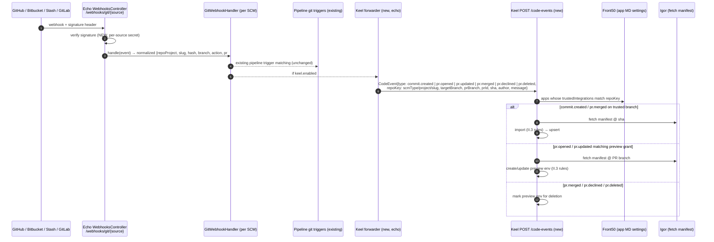

## II.6 Naming via pluggable namers

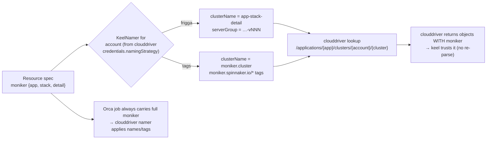

## II.7 Verification and notifications through platform primitives

- **Verification** = run an **Orca pipeline** or a **run-job stage** (Kubernetes Job today, ECS task later) with context: app, environment, artifact version, resource endpoints. Pass/fail and a link come back to keel. This replaces the Titus test container with something every OSS install can run, and reuses existing pipeline tooling and permissions (it runs as the managed SA).
- **Post-deploy** uses the same mechanism (a pipeline), plus rosco/clouddriver-native actions where they exist (AMI tagging).
- **Notifications** use echo's notification types (email, Slack, Teams, PagerDuty…), configured per environment the same way pipeline notifications are. The Slack interactive app (manual judgement buttons) stays as an optional add-on.

---

# Part III: Workstreams

## WS0: Hygiene and removals

### WS0.1 Titus removal inventory (keel side)

> **Delivered by the project-wide PR in [titus-removal.md](titus-removal.md) (D8).** Listed here so the keel reviewers know what that PR touches in keel.

Modules deleted: `keel-titus-api`, `keel-titus-plugin`.

| Location | What |
|----------|------|
| `keel/settings.gradle` | module includes |
| `keel-web/keel-web.gradle`, `keel-scm/keel-scm.gradle`, `keel-test/keel-test.gradle` | project deps |
| `keel-clouddriver`: `CloudDriverService.kt`, `model/ActiveServerGroup.kt`, `model/TitusActiveServerGroup.kt` | `listTitusServerGroups`, `titusActiveServerGroup`, Titus models |
| `keel-core/.../api/plugins/BaseClusterHandler.kt` | Titus references |
| `keel-docker/.../ContainerProvider.kt` | Titus container assumptions |
| `keel-ec2-api/.../Scaling.kt` | Titus scaling refs |
| `keel-scm/.../preview/utils.kt`, `PreviewEnvironmentCodeEventListener.kt` | Titus cluster renaming for preview envs |
| `keel-web`: `ExportService.kt`, `PassThruController.kt`, `KeelConfigurationFinalizer.kt` | Titus export shapes, test passthrough |
| `keel-web/config/keel.yml` | `keel.plugins.titus` |
| `keel-web/src/test/resources/examples/*titus*` | example configs |
| Tests: `keel-scm` preview tests, `keel-web` API doc/controller/YAML tests, `keel-sql` rollout tests, `keel-orca` deploy strategy tests, `keel-ec2-plugin` ImageTagger tests | re-point to EC2 fixtures |
| `keel-sql` Liquibase | new changeset: delete `titus/cluster@*` resources and their links |

**Salvaged contracts:** see [II.7](#ii7-verification-and-notifications-through-platform-primitives) and [titus-removal.md §Salvage](titus-removal.md#salvage-before-deleting).

### WS0.2 Dead or Netflix-only surface

- Gate proxies `/managed/reports/onboarding` and `/managed/reports/adoption`, but **keel has no such endpoints**. Remove them, or implement them as part of WS6 (an adoption report is useful for admins).
- Gate `exportResource` sends a `serviceAccount` query param that keel ignores (keel reads `X-SPINNAKER-USER`). Remove it or honor it.
- `ArtifactVersionLinks.kt` and `keel-scm/ScmUtils.kt` only build links for Stash and GitHub; everything else throws `UnsupportedScmType`. Add Bitbucket Cloud and GitLab (D1).
- `ExportService.SUPPORTED_TRIGGER_TYPES` includes `rocket` (Netflix CI). Replace it with the OSS trigger types (`jenkins`, `docker`, `git`, `pipeline`, `artifactory`, `helm`, `cdevents`, …).
- Netflix-specific version parsing (`nflx-base`, `-h<build>` regexes, Frigga `AppVersion`). See WS3 and WS4.
- `keel-network` hard-codes Eureka VIP DNS patterns (`NetworkEndpointProvider`). Make it optional or remove it.
- `keel-lemur` (Netflix Lemur certificates). Keep it optional and off by default, or move it to a plugin.
- The Rocket fake-artifact code-event path (`KNOWN_ROCKET_CODE_EVENTS`). Keep it behind a flag for one release after `/code-events` lands, then remove it.

### WS0.3 Documentation (repo)

The existing docs describe Netflix's deployment ("In Netflix's internal deployment…"). Replace them with:
- `keel/README.md`: a short version of Part I, linking here.
- `keel/docs/configuration.md`: every property from [I.9](#i9-schedulers-and-tuning), with recommended production values and the clouddriver load math.
- `keel/docs/authorization.md`: rewrite to the [II.4](#ii4-identity-model) model once WS1 lands.
- `keel/docs/operations.md` (new): pause/unpause, recheck, unhappy vetoes, "unmanaged vs deleted", DB maintenance, metrics to alert on (`keel.resource.check.*`, work queue drift gauges).
- `keel/docs/onboarding.md` (new): the [II.2](#ii2-onboarding-experience) flow with screenshots once built.
- Mermaid diagrams from this plan move into those docs as features land.

---

## WS1: Authorization (D5)

### WS1.1 Findings

| ID | Finding | Location | Severity |
|----|---------|----------|----------|
| A1 | **Git auto-import silently defaults the service account to the app owner's email.** If the imported file has no `serviceAccount`, it becomes `app.email`, a *human user*. Anyone who can push to the default branch then deploys as the app owner. | `keel-scm/.../DeliveryConfigImportListener.kt` (`it.copy(serviceAccount = app.email)`) | High |
| A2 | **Git auto-import runs no permission checks.** It is event-driven, with no request principal. The `serviceAccount` in the file is trusted as-is, and nothing verifies that the committer (or anyone) may use it. | same; `DeliveryConfigUpserter.upsertConfig` only validates structure | High |
| A3 | **Deck "Import now" checks the *stored* config's SA, not the imported one.** A user with access to the old SA can import a file that switches to a more privileged SA. | `keel-web/.../dgs/GitIntegration.kt:82-101` | High |
| A4 | **Preview environments deploy resource specs taken from the PR branch** (`configFromBranch`) under the main config's identity. Anyone who can open a PR with a matching branch name (including forks, depending on SCM) controls what gets deployed. | `keel-scm/.../preview/PreviewEnvironmentCodeEventListener.kt` (`createPreviewEnvironments`) | High |
| A5 | Resource and artifact export endpoints have no `@PreAuthorize`, and gate forwards them unguarded. The only protection is whatever clouddriver checks for the forwarded user. | `ExportController.kt`; gate `ManagedController.java:151,166` | Medium (verify) |
| A6 | No method-level auth on `VetoController` (incl. `POST /recheck/{id}`), `ArtifactController` (`/artifacts/events`, `/artifacts/sync`), or `AdminController` (`/poweruser/*`, incl. `DELETE /poweruser/applications/{app}`). | `keel-web/.../rest/*` | Medium (verify exposure) |
| A7 | `hasServiceAccountAccess(null)` returns `true`, so a REST upsert without `serviceAccount` skips the SA check. It then fails in `toDeliveryConfig()` ("no default applied"), so the outcome depends on the path taken. | `AuthorizationSupport.kt:85-86`, `SubmittedDeliveryConfig.kt:38-39` | Low |
| A8 | The system identity `keel@spinnaker.io` is hard-coded, not configurable, and not documented as needing Fiat registration. | 78 call sites | Medium |
| A9 | The shipped `keel.yml` has `services.fiat.enabled: false` with `legacyFallback: true`. | `keel-web/config/keel.yml` | Config |
| A10 | Echo webhook endpoints have no signature/HMAC verification. This becomes critical once code events drive deploys. | `echo-webhooks/.../WebhooksController.groovy` | Medium (cross-cutting) |

The Orca `importDeliveryConfig` stage is fine: it forwards the pipeline's user, and keel's REST upsert runs `checkPermissions()` against the **submitted** SA (`DeliveryConfigController.kt:212-217`).

### WS1.2 Reference pattern: pipeline managed service accounts

`orca-front50/.../tasks/SaveServiceAccountTask.java`:
- A pipeline declares `roles: [...]`. On save, Orca creates or updates a front50 `ServiceAccount` named `<pipelineId>@managed-service-account` (or a role-hash `@shared-managed-service-account` when `tasks.use-shared-managed-service-accounts=true`) with `memberOf = roles`.
- **Authorization:** the saving user must hold *all* requested roles, or be admin (`isUserAuthorized`).
- Triggers then `runAsUser` that account. Fiat syncs it like any other SA.
- Front50 migrations `DeleteDanglingServiceAccountsMigration` / `SharedManagedServiceAccountsMigration` manage the lifecycle.

### WS1.3 Target model

The target model is described in [II.3](#ii3-config-sources-and-trusted-integrations) and [II.4](#ii4-identity-model). Implementation steps:

1. **Shared helper.** Extract `isUserAuthorized(user, roles)` and SA naming from `SaveServiceAccountTask` into a shared library (candidates: `fiat-api`/`fiat-core` client utilities, or kork-security). Orca and gate/keel both use it.
2. **Front50/gate:** an endpoint (or an extension of the app update path) that saves `managedDelivery.roles` and creates or updates `<app>@managed-delivery-service-account`. Teach the front50 migrations the new suffix so they don't delete these accounts as dangling.
3. **Keel:**
   - `SubmittedDeliveryConfig.serviceAccount` defaults to the app's managed SA (fixes A7).
   - Event-driven imports ignore or verify the file SA (fixes A1 and A2).
   - Deck import checks the incoming SA (fixes A3).
   - Preview envs get the grant plus constraints (fixes A4).
4. **System identity:** `keel.system-identity`, default `keel@spinnaker.io` for compatibility. Document the required Fiat registration (fixes A8). Ship `keel.yml` with Fiat enabled in the kustomize overlay (A9).
5. **Endpoint lockdown:** `@PreAuthorize` on export (ACCOUNT READ), veto/recheck (APP WRITE), artifact/code-event ingestion (service identities or admin), and `/poweruser/*` (Fiat admin) (fixes A5 and A6).
6. **Audit:** emit an event for each config import (source, actor/integration, SA used, diff summary) to echo, so it lands where pipeline audit events go.

### WS1.4 Auth open questions

- Should managed-delivery SAs share the pipeline suffix / role-hash namespace (fewer SAs), or stay separate for auditability?
- Where should the shared role-check helper live: kork-security, fiat-api, or front50?
- What is the convention for a service's own system identity? No standard exists in the repo (no `*@spinnaker.io` constants outside keel).

---

## WS2: SCM code events via echo

Current behavior: [I.4](#i4-getting-a-config-into-keel-today). Target: [II.5](#ii5-code-events-via-echo).

1. **Keel `POST /code-events`:** a typed `CodeEvent` API. Stop overloading `/artifacts/events`, and keep the Rocket mapping behind a flag for one release.
2. **Echo forwarder:** after `GitWebhookHandler.handle(...)`, map the normalized event to a `CodeEvent`. Per-SCM mapping work:
   - `repoKey = {scmType}/{repoProject}/{slug}`. `scmType` must match front50 `app.repoType` and igor's type names (`github`, `stash`, `bitbucket`, `gitlab`).
   - push → `commit.created`. PR opened/synchronized/merged/declined/deleted → `pr.*`.
   - **Verify each handler's `branch` semantics (source vs. target).** GitHub's `GithubPullRequestEvent` currently puts only `branch`, `number`, `state`, `title`, and needs the base ref and the merged flag.
   - Author and message aren't normalized today. Add them where the payload has them.
3. **Signature verification (A10):** GitHub `X-Hub-Signature-256`, Bitbucket/Stash webhook secret, GitLab `X-Gitlab-Token`. This is a prerequisite for auto-import.
4. **Auto-import:** gate it on `trustedIntegrations.git` instead of `importDeliveryConfig: true` + repo match + default branch.
5. **Preview environments:** gate them on `trustedIntegrations.preview`. After Titus removal they are EC2-only until ECS/k8s land, so ship them **off by default**.
6. **Links:** add Bitbucket Cloud and GitLab to `ScmUtils` / `ArtifactVersionLinks`, using igor's configured base URLs.

Open questions:
- Should keel also accept echo's existing `/webhooks/cdevents/{source}` (`change.created`, `change.merged`) as a vendor-neutral path?
- Should echo forward all git events, or only events for repos linked to MD-enabled apps (less keel load)? Keel filters via `front50Cache.searchApplicationsByRepo` today.

---

## WS3: Baking via rosco (D4)

Keel already bakes **through Orca's `bake` stage → rosco** (`keel-bakery-plugin/.../ImageHandler.launchBake`). The Netflix coupling is around that call:

| Coupling | Location | Plan |
|----------|----------|------|
| Duplicate base-image map (`keel.plugins.bakery.baseImages`, 2019 `bionicbase`/`xenialbase` AMIs) | `DefaultBaseImageCache`, `keel.yml` | Use rosco's own base images: validate `baseOs`/`baseLabel` against rosco `/bakeOptions`. Keel should never know AMI names. |
| Artifact payload `"location": "rocket"`, hard-coded `/${pkg}_${ver}_${arch}.deb` reference | `ImageHandler.kt` | Use the `PublishedArtifact` reference from the Debian supplier and let rosco resolve it, like the pipeline Bake stage does. |
| Netflix `AppVersion` parsing to find existing images | `ImageHandler`, `ImageService.getLatestNamedImages` | Keep as default (rosco AWS templates write the `appversion` tag), but make it pluggable (WS4 `VersionParser`). |
| `BakeryMetadataService` (package diff) is an interface with **no OSS implementation** | `keel-bakery-plugin` | Drop it, or back it with rosco if rosco can report package manifests. |
| AWS only (`cloudProviderType: aws`) | `ImageHandler` | Keep scope AWS. Container artifacts need no bake. |

Reposition the module as a "rosco image integration". Keel only ever *requests* a bake through Orca, so however rosco evolves (see [scoped-execution-credentials.md](scoped-execution-credentials.md)), keel doesn't change.

---

## WS4: Naming: Frigga → pluggable monikers (D6)

### WS4.1 Initial check

- **Keel's direct Frigga use is small.** `com.netflix.frigga` is imported in 5 files: `Names.parseName` (`keel-core/.../core/moniker.kt` `parseMoniker`), `NameValidation.checkName` (app-name validation), `ami.AppVersion` ×3 (bakery and clouddriver image lookups).
- **The convention runs deeper than the imports:**
  - `Moniker.toName()` hard-codes `app-stack-detail`. It is the clouddriver **cluster lookup key** and is also used for SG self-references and Eureka DNS names.
  - `Moniker.withSuffix()` assumes a 32-char name budget (preview-env renaming).
  - `parseMoniker(name)` is called in `ClusterHandler`, both LB handlers, `ExportService` and `ExportController`.
  - `moniker.serverGroup` / `-vNNN` sequence formatting (`moniker.kt` `sequenceString`).
- **What already helps:** keel's clouddriver models (`ActiveServerGroup`, LB and SG models) **already deserialize clouddriver's `moniker`**, and keel **already sends `moniker` to Orca** on every cluster operation (`orcaClusterMoniker`).
- **Clouddriver side:** `NamerRegistry` supports a per-account `namingStrategy`. ECS has `EcsTagNamer` (`moniker.spinnaker.io/{application,cluster,stack,detail,sequence}` tags). Kubernetes uses the same keys as annotations. Google has labels, Lambda has tags. **clouddriver-aws (EC2) has no tag namer.**

### WS4.2 Proposal

```kotlin
interface KeelNamer : SpinnakerExtensionPoint {
  val name: String                                   // "frigga" (default), "tags", ...
  fun clusterName(moniker: Moniker): String          // lookup key for clouddriver
  fun serverGroupName(moniker: Moniker): String
  fun parse(name: String, tags: Map<String, String>? = null): Moniker   // fallback only
  fun validateApplicationName(app: String): Boolean
  val maxNameLength: Int
}
```

- **Selection per account:** mirror clouddriver's `namingStrategy`, read from `/credentials/{account}` (already cached via `CloudDriverCache.credentialBy`), so there's one source of truth. Optional override `keel.naming.accounts.<account>`.
- **Read path:** trust clouddriver's `moniker`. Call `parse()` only when it's absent.
- **Write path:** always send the full `moniker` to Orca (already done). Tag namers apply tags in clouddriver.
- **App-version parsing** moves to a `VersionParser` next to the artifact `SortingStrategy`, not into the namer.
- **Scope:** EC2 stays `frigga`; an AWS tag namer would be a separate clouddriver project. ECS and K8s are built on the SPI from day one. The SPI lands before WS7.

---

## WS5: Operational correctness and scale

| Issue | Location | Plan |
|-------|----------|------|
| Checks in a batch run **one after another** (`withTimeout { launch {…} }` waits for its child) | `CheckScheduler` (all loops) | Launch per-item coroutines under one `supervisorScope`, each with its own timeout. Make concurrency configurable. |
| Shipped `keel.yml` sets `resourceCheck.minAgeDuration: 10s` and `artifact-refresh.frequency: PT1M` | `keel-web/config/keel.yml` | Return to code defaults (1m / hours). Document the clouddriver load math. |
| Docker lookup scans **all** registry accounts (`findDockerImages(account = "*")`) | `DockerArtifactSupplier` | Allow account/registry on `DockerArtifact`. Rely on igor events rather than polling. |
| MySQL lease deadlock history (two query variants) | `SqlResourceRepository.itemsDueForCheck*` | Keep the multi-query default. Load-test with more than one replica. |
| MariaDB compatibility unverified (#7821 hit other services) | driver stack | Test it, or document MySQL-only. |
| Removing a resource from config leaves the cloud resource running, and the UI doesn't say so | `CombinedRepository`:162 | Make it explicit in the UI. Consider an opt-in per-environment `prune` (important for k8s users). |

---

## WS6: UI and onboarding

- **WS6.1 Onboarding wizard:** [II.2](#ii2-onboarding-experience). Backed by existing endpoints: `GET /export/{application}`, `GET /export/{provider}/{account}/{type}/{name}`, `GET /export/artifact/...`, `POST /delivery-configs/diff`, `POST /delivery-configs/validate`. New: MD settings + managed SA save (WS1), and a JSON-schema-backed YAML editor (keel already generates schema: `keel-schema-generator`, `GET /delivery-configs/schema`).
- **WS6.2 Everyday UX:**
  - Per-resource "what keel would change" (the `ResourceDiff` the actuator already computes).
  - Clear pause / unmanaged / unhappy / vetoed states with authorized one-click actions.
  - Resource registry: drop `titus/cluster` (done by the Titus PR), add `ecs/*` and `k8s/*` as providers land.
  - Consolidate `MANAGED_DELIVERY_ENABLED`, `MD_GIT_INTEGRATION_ENABLED` and `MANAGED_RESOURCES_ENABLED` into one server-driven capability flag.
- **WS6.3 Verification:** a generic evaluator that runs an Orca pipeline or run-job ([II.7](#ii7-verification-and-notifications-through-platform-primitives)), keeping the salvaged Titus test-container contract (context in, pass/fail + link out).
- **WS6.4 Notifications:** route through echo notification types. Slack app optional.
- **WS6.5 Install:** a kustomize overlay with working `keel-local.yml` (MySQL, Fiat on, system identity) plus the gate/echo/igor/deck toggles in one place.
- **WS6.6 Admin report:** implement (or remove) the gate `reports/adoption` and `reports/onboarding` proxies. Showing which apps are managed, paused or failing is useful for platform teams.

---

## WS7: Providers

### WS7.1 ECS (first)

This fits the existing `BaseClusterHandler` model: monikered server groups per account/region, Docker artifacts, red/black. Clouddriver ECS already has create/clone/resize/enable/disable/destroy/scaling-policy operations and `EcsTagNamer`.
- `keel-ecs-api` / `keel-ecs-plugin`: an `ecs/cluster@v1` spec. Task definition: container image from a Docker artifact, cpu/mem, env, ports, secrets refs. Service: launch type / capacity provider, capacity, target groups, subnets/SGs, scaling.
- `current()` via clouddriver `/applications/{app}/clusters/...?cloudProvider=ecs`, plus `export()`.
- ECS-specific diff rules: task-definition revision churn, server-populated fields.
- Deck: resource registry entry and links into the `deck/packages/ecs` views.

### WS7.2 Kubernetes (second; needs a design spike)

Kubernetes doesn't fit the server-group model: the unit is a manifest, and the cluster already reconciles.
- **Starting point:** a `k8s/manifest@v1` handler. Desired = manifest(s) + artifact bindings (image substitution). Current = clouddriver manifest endpoint. Actuation = Orca `deployManifest`. Naming = `moniker.spinnaker.io/*` annotations.
- Spike questions:
  - diffing server-populated fields and clouddriver-versioned objects (`-vNNN` ReplicaSets)
  - prune semantics (WS5)
  - Helm/Kustomize via rosco bake-manifest vs. Flux-style delegation ([prior-art plugin](https://github.com/nimakaviani/managed-delivery-k8s-plugin) used Flux2)
  - coexisting with Argo CD/Flux already in the cluster (keel as the promotion engine only?)

---

## Sequencing

Independent work lands first. Coupled pieces are combined, not chained across PRs.

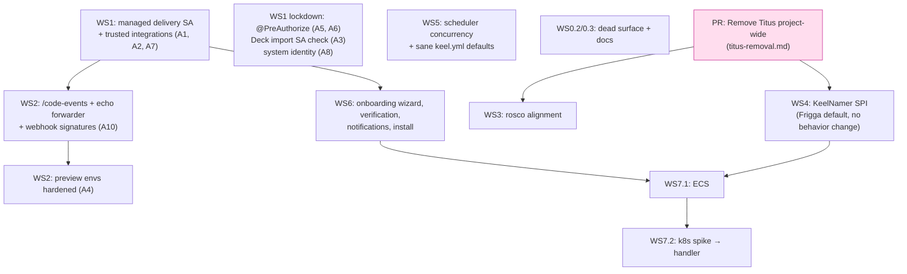

1. **Titus removal PR** (separate, project-wide).
2. In parallel, independent: WS1 lockdown slice, WS5 scheduler fixes, WS0.2/0.3 cleanup and docs.
3. WS4 naming SPI (after Titus, so there's one less cluster handler to port).
4. WS1 managed SA + trusted integrations.
5. WS2 code events (needs step 4), then preview-env hardening.
6. WS3 rosco alignment (any time after Titus).
7. WS6 onboarding/verification/notifications (needs step 4).
8. WS7.1 ECS, then the WS7.2 k8s spike.

## Open questions

- Do any OSS users run keel today? That decides how gentle the Titus migration and the `serviceAccount` semantics change must be (release notes + one-release deprecation window?).
- Should app MD settings live in front50 application attributes (current `managedDelivery` block) or in keel's DB? Front50 is where pipeline SAs and repo info already live, and Deck's app config UI can edit it.
- Should GraphQL (DGS) stay the UI contract, or should new onboarding endpoints be REST + OpenAPI like the rest of gate? The gate MCP `KeelTools` uses REST.
- Should `spin` get Managed Delivery commands ("export → diff → apply") that mirror the wizard for automation? It has none today (`spin/cmd` has no delivery-config commands).

## Changelog

- 2026-09-26: Initial draft from code and history analysis.
- 2026-09-26: Added Part I (how it works today, with diagrams) and Part II (target design, with diagrams). Split Titus removal into project-wide [titus-removal.md](titus-removal.md) (D8). Added the WS0.3 docs plan and a sequencing graph.
